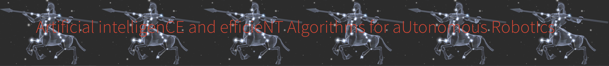

<!--
 * @Developer: ACENTAURI team, INRIA institute
 * @Author: Ziming Liu
 * @Date: 2021-02-26 22:07:42
 * @LastEditors: Ziming Liu
 * @LastEditTime: 2024-02-08 17:16:34
-->

# HDVO (Hybrid Dense Direct Visual Odometry)

## Introduction

This is a codebase for hybrid methods in visual perception and localization, which has the advantage of both data-based representation and traditional model-based robustness. This project is developed at [ACENTAURI team, INRIA](https://team.inria.fr/acentauri/). 




## Major tasks

This code can support these tasks: 

- Stereo/Monocular depth estimation 
- hybrid/deep visual odometry


## Start to use it

Prepare the dataset according to [prepare_dataset.md](docs/prepare_dataset.md)

Install the running environment and dependencies [env.md](docs/env.md)

For the training and testing, please see [train.md](docs/train.md) and [inference.md](docs/inference.md). 


## Model list


Stereo 

- [StereoOne](configs/stereoone)
- [PSMnet](configs/psmnet)


Visual odometry

- [HDVO](configs/hdvo)


## Citation & References
If you use this codebase or models in your research, please cite the following references. A technical report may be released later.

```
@inproceedings{HDVO-IROS-2022,
  title={A New Dense Hybrid Stereo Visual Odometry Approach},
  author={Liu, Ziming and Malis, Ezio and Martinet, Philippe},
  booktitle={IROS},
  pages={6998--7003},
  year={2022},
  organization={IEEE}
}

@inproceedings{maskHDVO-ITSC-2023,
  title={Multi-masks Generation for Increasing Robustness of Dense Direct Methods},
  author={Liu, Ziming and Malis, Ezio and Martinet, Philippe},
  booktitle={ITSC},
  year={2023},
  organization={IEEE}
}

@inproceedings{StereoOne-ICASSP-2024,
  title={StereoOne: One-stage Deep Stereo Network},
  author={Liu, Ziming and Malis, Ezio and Martinet, Philippe},
  booktitle={ICASSP},
  year={2024},
  organization={IEEE}
}

```


Part of code is from [mmaction](https://github.com/open-mmlab/mmaction), [openrox](https://github.com/robocortex/openrox). 


## Contact

If you have questions, you can contact $liuziming.email@gmail.com$. 